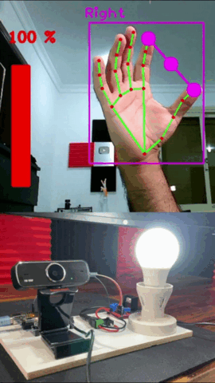

# Система распознавания жестов

Дополняющий модуль к умному дому на основе камеры, для определения жестов рук и возможность выставления команд на эти жесты(включить свет, регулировать яркость, открыть окно и т.д.)

##  Референсы

## Схемы
- [ ] Про Serial.read() и схемы модулей

## Cценарии  использования
Управление arduino-проектами жестами:
* Назначение вариаций пальцев на конкретный модуль
* Отправка сигнала на модуль (регулирование, включение)

## Компоненты

| Компонент                                                                                                                                                                                                                                                                                                                                                                                                                                                                             | Вес (г) | Количество | Цена (₽) |
|---------------------------------------------------------------------------------------------------------------------------------------------------------------------------------------------------------------------------------------------------------------------------------------------------------------------------------------------------------------------------------------------------------------------------------------------------------------------------------------|---------|------------|----------|
| [ESP32-CAM](https://www.ozon.ru/product/esp32-cam-397701112/?advert=rVKZ49WPOO_uiu4bAz4qMKW4tveyugPQ9PPe3UAXY2IqTtdjcIHNB9xxKzePR0sPQc3fU-WlLSuGgDLELudsmLUI_Nm5gQHu0RjOKEbHuy84uUIeNuMAefUHGmHHu2h0mDnvG_58SDleBgcp5dEc_Az4hLqScPx3LeRIhDF37bZdH8o3h0n48YU_AhNfHF35EIOE26_4atXP9mgbVbmv7FzLX4F8T0OlZ3gn3DBX9xA5gZBd-om5fvw1NAq8PYw_2fFUMqHB9wq4DsU8SlgsiiDM6SKvlGwLsMdi59RE7HtFi7Ao3es15kpLWC_UrR_H4NysgwjdXc6jvZMweKGfhVIf1veEEi8&avtc=1&avte=2&avts=1709638730&keywords=esp32-cam) | 10      | 1          | 769      |
| [ESP8266](https://www.ozon.ru/product/kontroller-wi-fi-nodemcu-v3-lolin-na-baze-esp8266-630277877/?asb=OcpiYZFJ3EYOOooFqMnDcu%252F5wLRAtryWYX8lBQ8WlVk%253D&asb2=GKL-DMPVmhqE9htTtHtleK2ueU7wGzizM0h6T4YXg8nrRQidSZNE__rLoj8WIoLchUutz0xoJh1UyooWKwdEaw&avtc=1&avte=2&avts=1709639175&keywords=esp)                                                                                                                                                                                   | 10      | n          | 365      |

